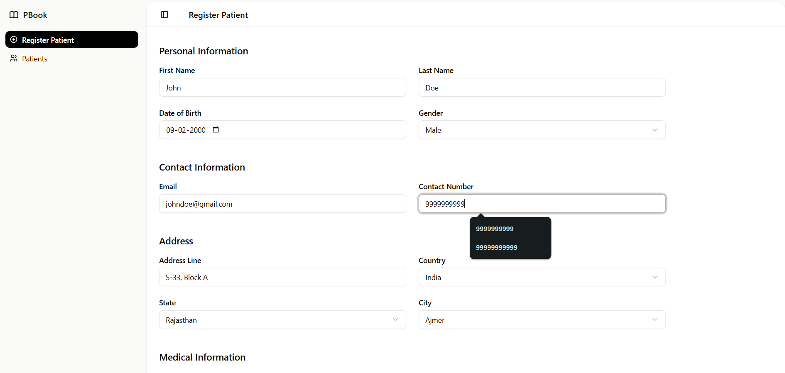
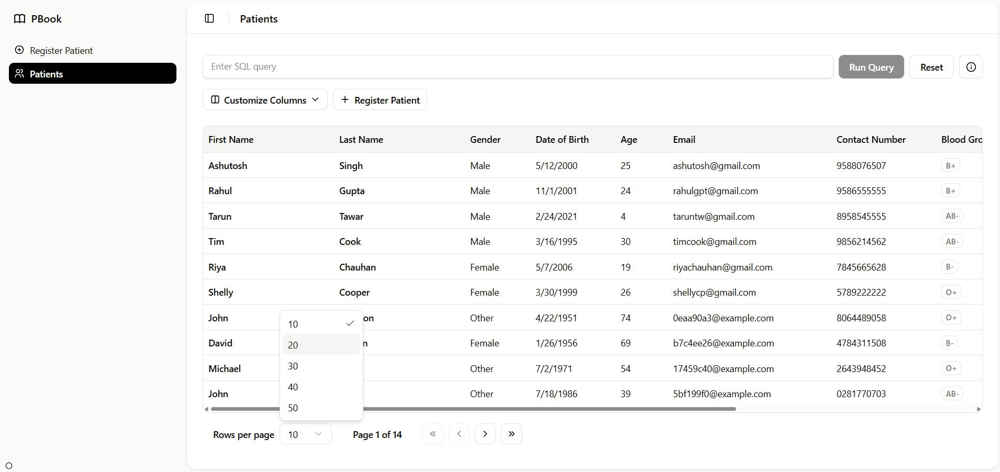
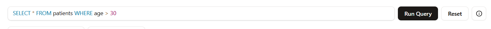
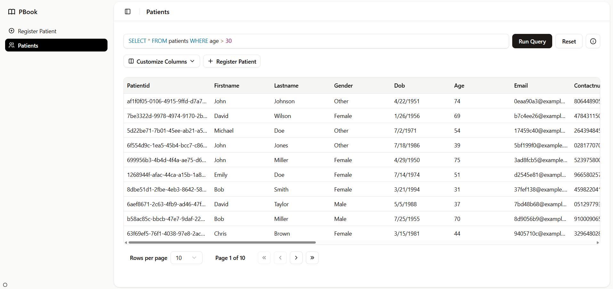
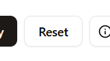
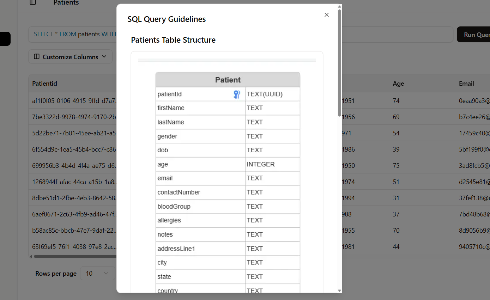

# PBook

A Next.js application for patient registration and search with real-time tab synchronization.


## Features

- Patient registration form with validation
- Comprehensive patient listing with pagination, column resizing, and hide/unhide functionality
- Raw SQL search functionality with syntax highlight
- Real-time synchronization across browser tabs
- Responsive UI built with shadcn/ui components
- Local-first database using PGLite (IndexedDB)

## Prerequisites

- Node.js v18+
- npm v9+
- CountryStateCity API key

## Setup & Installation

1. Clone the repository:

   ```bash
   git clone https://github.com/ashutosh-s15/pbook.git
   ```

2. Install dependencies:

   ```bash
   npm install
   ```

   If you encounter shadcn/ui issues::

   ```bash
   npm install --legacy-peer-deps
   ```

3. Set up environment variables:

- Copy `.env.example` to `.env.development`
- Add your API key:
  ```bash
  NEXT_PUBLIC_CSC_API_KEY="your_api_key_here"
  ```

4. Start the development server:

   ```bash
   npm run dev
   ```

5. Open http://localhost:3000 in your browser

## Deployment

The application is deployed on Vercel:  
🔗 [https://pbook-two.vercel.app/](https://pbook-two.vercel.app/)

## Usage

1. Register/Add a Patient.
   

2. View the patient list in a paginated table.
   

3. Use the SQL query box to search patients with raw `SELECT` queries and view the result in paginated table.
   
   

4. Click "Reset" to restore the default table view.
   

5. Click "Info" to view SQL query guidelines.
   

## Development Challenges

### 🔍 SQL Search Implementation

Creating a simple but robust SQL raw query search functionality was challenging, as I needed to consider various edge cases and validations to ensure both good user experience and security. The implementation required careful handling of:

- Different search patterns and input formats
- Security considerations to prevent injection
- Performance optimization for responsive results

### 🔄 Tab Synchronization

Implementing the tab sync functionality was particularly interesting as it was my first time building this feature. The challenge involved:

- Learning the BroadcastChannel API
- Handling state consistency across multiple tabs
- Ensuring real-time updates without performance hits

## Planned Improvements

### 🏥 UI Library Upgrade

During my research, I discovered Medblocks UI which would have been an excellent choice for the patient registration app. However, due to time constraints from my work commitments and project's deadline, I opted to use UI libraries I was already familiar with.

### 🗃️ Database Schema Refinement

To keep the initial implementation simple (since this is primarily a patient register/listing app), I used a single patient table structure. For a more scalable solution in larger applications, I would:

- Create separate tables for contacts, allergies, and addresses
- Implement proper relationships between entities
- Add more robust data validation at the database level

### 🔄 Advanced Tab Sync

While the current BroadcastChannel implementation works, I discovered PGLITE Multi-tab workers late in development which could provide a more elegant solution for handling multiple database instances across tabs.
